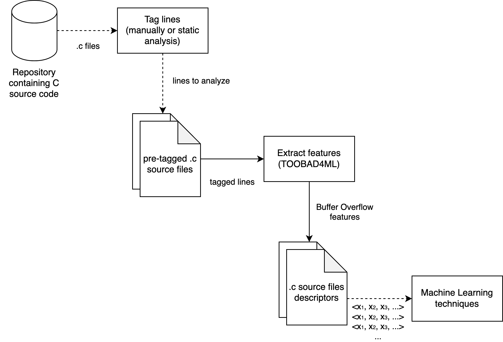

# TOOBAD4ML - TOOl to Buffer overflow Analysis and Description FOR Machine Learning

A tool for extracting features of Buffer Overflow vulnerabilities written in C code in order to further analyze them with Machine Learning techniques.

## Overview



The input consists of one or several *.c* files that are processed for lexical analysis. The aim of this analysis is to extract an arbitrary number of features that describe a Buffer Overflow. To do so, the input must be pre-tagged: either manually or by means of static code analysis. Finally, the output is a set of vector descriptors, which can be exported to various formats in order to create a dataset suitable to be analyzed using Machine Learning techniques.

## Getting started

### Prerequisites

| Tool                       | Version | Required           | Description            |
|----------------------------|---------|--------------------|------------------------|
| [CMake](https://cmake.org) | 3.1+    | :heavy_check_mark: | Build automation       |
| [Conan](https://conan.io/) | 1.27+   |                    | C++ dependency manager |
| [Doxygen](https://www.doxygen.nl/) | 1.20.0+ |            | Document generation|

### Dependencies

The following libraries are used by TOOBAD4ML:

* [Clang LibTooling](https://clang.llvm.org/docs/LibTooling.html) version 5.0.0 or later.
* [Google Test](https://github.com/google/googletest) version 1.10.0 or later (only for testing).

You can optionally use [Conan](https://conan.io) to manage these dependencies. However, please note that Clang is not currently available in the official repositories. To get it, you must add the following remote repository *before* running the `conan install` command:

```bash
conan remote add roboticsgroup https://ciserver.unileon.es:8082/artifactory/api/conan/conan-dev
```

## Building the project

In order to build the project you have two options: CMake or Conan.

### CMake

Before building TOOBAD4ML you must create a separate directory for the build files because in-source builds are not allowed. Then go to that directory (as all the building process must be done inside it) and type:

```bash
mkdir build && cd build
```

If you plan to use Conan only to manage dependencies, type the following command *before* using CMake:

```bash
conan install .. -s compiler.libcxx=libstdc++11
```

Once set, you can build TOOBAD4ML using your preferred generator. For instance, to build with [Ninja](https://ninja-build.org), type:

```bash
cmake .. -G "Ninja"
```

Additionally, you can add the following CMake options to the previous command as compile definitions:

| Option                   | Values    | Description         |
|--------------------------|-----------|---------------------|
| TOOBAD4ML_ENABLE_TESTING | [ON, OFF] | Build unit tests    |
| TOOBAD4ML_GENERATE_DOCS  | [ON, OFF] | Build documentation |

For instance, to build TOOBAD4ML unit tests you should type:

```bash
cmake .. -G "Ninja" -DTOOBAD4ML_ENABLE_TESTING=ON
```

Finally, build the project with:

```bash
cmake --build .
```

If unit tests are built, it is recommended to run them with CTest. CMake generates the CTest configuration files inside the `build` directory, so in order to run it just type:

```bash
ctest -VV
```

### Conan

A Conan recipe is included to facilitate the building process. Just type:

```bash
conan create . toobad4ml/0.1.0@ -s compiler.libcxx=libstdc++11
```

You can also build TOOBAD4ML with the following options:

| Option      | Values        | Description         |
|-------------|---------------|---------------------|
| build_tests | [True, False] | Build unit tests    |
| build_docs  | [True, False] | Build documentation |

For instance, to build TOOBAD4ML unit tests you should type:

```bash
conan create . toobad4ml/0.1.0@ -s compiler.libcxx=libstdc++11 -o build_tests=True
```

Please note that Conan will build TOOBAD4ML in the local cache. In order to access the binary, you should deploy it by typing:

```bash
conan install toobad4ml/0.1.0@ -s compiler.libcxx=libstdc++11 -if=bin
```

The tool will be deployed inside `bin` directory.

## Usage

```bash
./toobad4ml_exe <path_to_file_or_to_multiple_files.c> -d=DESCRIPTOR -f=FORMAT -o=FILENAME --
```

### Supported arguments

| Argument | Value | Description |
|----------|-------|-------------|
| -d       | Padmanabhuni | Descriptor model proposed by [Padmanabhuni and Tan (2015)](https://doi.org/10.1109/COMPSAC.2014.62) |
| -f       | STD   | Standard output |
|          | CSV   | CSV format      |
| -o       |       | Name of the output file¹ |

¹ *Only valid if filename is provided and `format` argument is different from STD. Otherwise, this flag is ignored.*

### Tagged source files format

The tool accepts pre-tagged *.c* files that contain comments appended at the end of each file. Such comments (see code below) start with line `/// ###BEGIN_VULNERABLE_LINES###` and is followed by several lines with the format `/// starting_line,starting_offset;ending_line,ending_offset` (with offset being the column).

```c
/// ###BEGIN_VULNERABLE_LINES###

/// 1126,3;1126,9

/// 1153,9;1153,15

/// 1341,9;1341,15

/// 1734,6;1734,12
```

These lines represent the lines of code that TOOBAD4ML will analyze and extract features from. For a list of examples, please check the `data` directory.

## Credits

This tool is licensed under [MIT license](https://choosealicense.com/licenses/mit/). It has been funded by the Addendum no. 4 to the Universidad de León-Instituto Nacional de Ciberseguridad (INCIBE) Convention Framework on the "Detection of new threats and unknown patterns" and was originally designed and developed by the following people:

* Gonzalo Esteban
* David Fernández
* Razvan Raducu
* Flavio Rodrigues